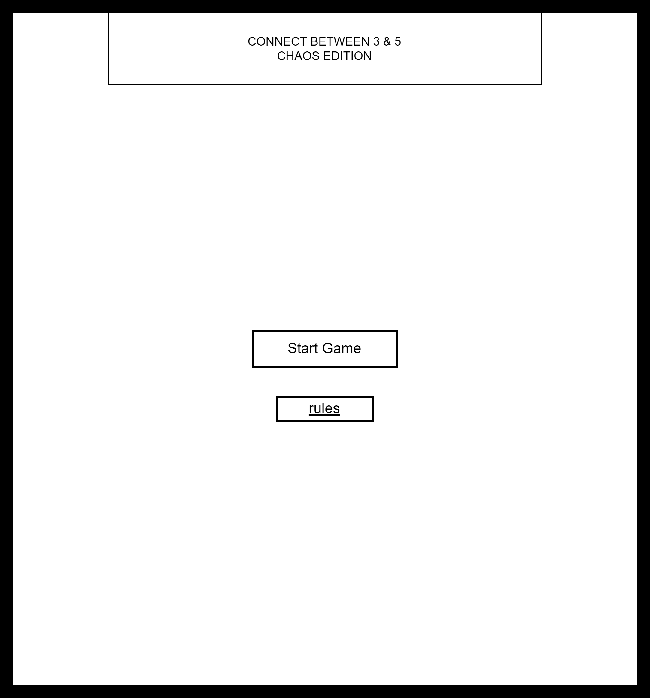
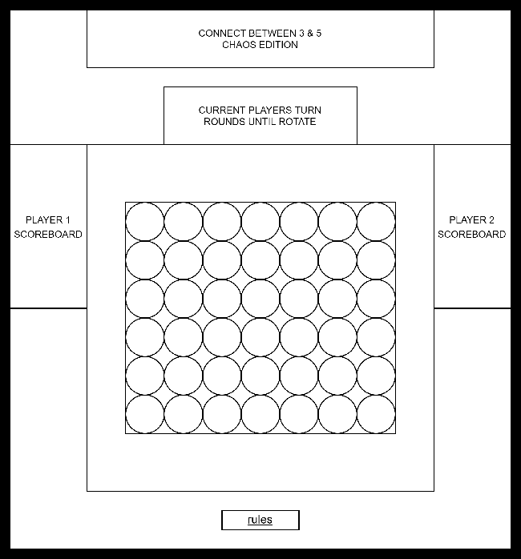
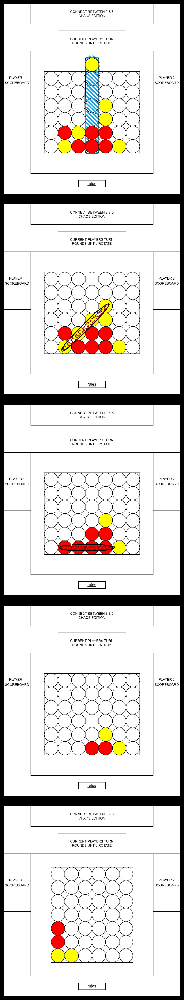
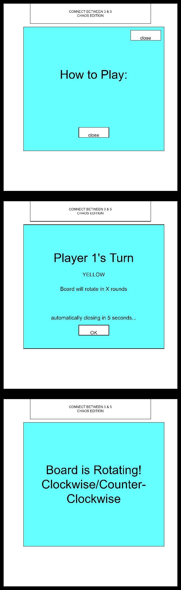

# Connect Between 3 and 5 -- Chaos Edition

# Overview

All though Connect 4 was first published by Milton-Bradley (now Hasbro) in 1974, that game is much older. In fact, Captain Cook was known for spending may hours playing this classic game with crewmates while out at see.
In Connect Between 3 and 5 -- Chaos Edition, two players will face off head-to-head, playing the classic game with a few twists:
- When a line of between 3 and 5 is made, instead of the game ending, the player who controls that color will earn 1000, and the tokens in that line will be removed, allowing any tokens above them to fall into the new space. This can cause chain-reactions where additional lines are removed
- After every third round, the game board will randomly rotate 90 degrees, either clockwise or counter-clockwise, and the tokens will shift accordingly.
- The first player to earn 1000 of points wins, or the player with the highest number of points will win if the gameboard is entirely filled

## User Stories

- As a user, I want the ability to start the game.
- As a user, I want the ability to clearly know whose turn it is.
- As a user, I want the ability to refrence the rules at anytime, without ending the game.
- As a user, I want the ability to know how may points each user has.
- As a user, I want the ability to know how may rounds are left before the gameboard turns.
- As a user, I want the ability to see an announcment when it is the next players turn, that can be closed manually, or close automatically after a certain amount of time.
- As a user, I want the ability to recieve a seperate warning when there is only one round remaining before the game board rotates.
- As a user, I want the ability to be able to place my colored token when it is my turn.
- As a user, I want the ability to see a viual indication for which column I will drop my token into before I commit, and know where the token will ultimately end up.
- As a user, I want the ability to see a visual indication when I achieve four in a row.
- As a user, I want the ability to see an animation when this 4 in a row is removed and the rest of the tokens move because of it.
- As a user, I want the ability to see an animation for when the gameboard rotates and the move accordingly.
- As a user, I want the ability to see an indication when a player wins and which player it was with final scores.
- As a user, I want the ability to be able to start a new game when the game ends.

# Wireframes

## Layout upon loading the webpage

## Layout upon starting a new game

## Basic Game Flow
(Yellow player selects a column, yellow player scores between 3 and 5 in a row,
line is cleared scoring red a between 3 and 5 in a row, the new scoring line is cleared, board rotates and updates token positions)

## Various Messages Appear Over the Current Screen

## ERD's
As no Database is being used, the following represents main game flow outline

I will be manipulating flex boxes or grid boxes in the DOM for all animations, and using simple algorithms and objects for win/score detections

```
gameBoard [
    1,2,3,4,5,6,7,
    8,9,10,11,12,13,14,
    15,16,17,18,19,20,21,
    22,23,24,25,26,27,28,
    29,30,31,32,33,34,35,
    36,37,38,39,40,41,42
]
token {
    color: (which player it represents)
    location: (which loaction on the gamBoard array)
}

function - placeToken - alows token to be placed in any available column
function - detectLine - looks at each row top to bottom for a scoring shape using math based on the gameBoard Array (a column would be current position plus 7 + 14 + 21 all being the same color). Returns boolean
function - removeLine - removes a line that scores, then runs repositon(), then detectLine and repeats until detectLine fails
function - rotateGameBoard - rotates the DOM game board +- 90 degrees then runs repostion(), detectLine, then removeLine
function - repostion - move all tokens that can move based on tokens being removed or game board rotating

```